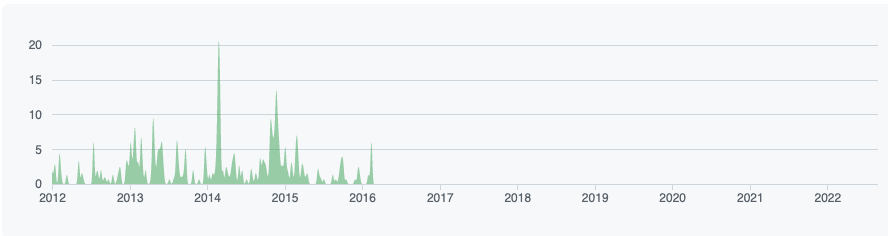

== The Long Road of Eclipse Collections

* Keys to survival
** *Grit*, *Committers*, *Storytelling*, *Community*
* Eclipse Collections' Long Road -- 2004 - 2022
** Caramel - 2004 (Goldman Sachs Proprietary)
** link:https://github.com/goldmansachs/gs-collections[GS Collections] - 2012 (Goldman Sachs OSS)

** link:https://github.com/eclipse/eclipse-collections[Eclipse Collections] - 2015 (OSS at Eclipse Foundation)
image:../assets/ec_contributions.png[Eclipse Collections Contribution Graph]

---

link:./00_toc.adoc[⬆️ TOC] /
link:02_journey.adoc[⬅️ Intro] /
link:./04_planning_survival.adoc[➡️ Planning for Survival]

===== link:https://twitter.com/hashtag/IntelliJIDEAConf[#IntelliJIDEAConf] link:https://twitter.com/TheDonRaab[@TheDonRaab]
