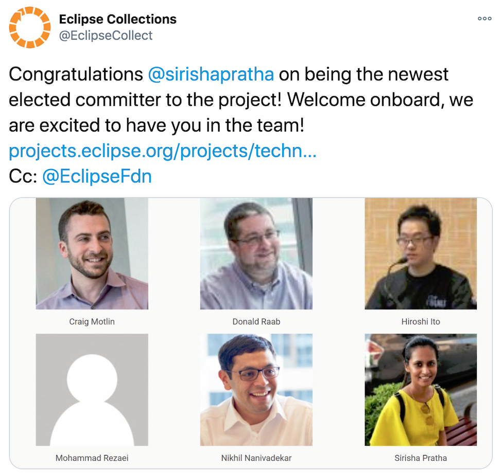

== Think in Decades

=== Eclipse Collections
* link:A1_oss_story_decadeone.adoc[First decade] -- Development by a Financial Services Firm
** Free as in "beer" - link:https://github.com/goldmansachs/gs-collections[GS Collections]
** 4 Committers
** ~15 Contributors
** ~20K downloads per month
* link:A2_oss_story_decadetwo.adoc[Second Decade] -- Development at the Eclipse Foundation
** Free as in "speech" - link:https://github.com/eclipse/eclipse-collections[Eclipse Collections]
** 6 Committers
** ~100 Contributors
** ~220K downloads per month
* Third Decade -- Community driven at the Eclipse Foundation
** Free as in "me" - It's time to let the community drive
** link:https://donraab.medium.com/the-next-5-years-for-eclipse-collections-a1f3ce896c2c?source=friends_link&sk=9c250b7bcfc76635e2fe4bc568342d4f[The next 5 years for Eclipse Collections] - some of my thoughts on potential work in the library
** More Consumers, Contributors and Committers wanted!

---

link:./00_toc.adoc[⬆️ TOC] /
link:04_planning_survival.adoc[⬅️ Planning Survival] /
link:./06_reflect_on_goals.adoc[➡️ Reflect on goals]
