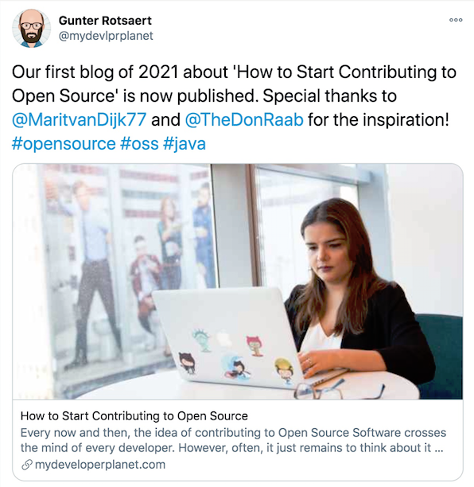

== Grow the Community

==== Engage new OSS contributors
* Be inviting, patient and kind

==== Network with the community
* Be social, present, and authentic

==== Build a legacy
* Build katas to help build confidence
* Mentor and elect new committers
* Support the core team of committers
* Turn celebrations into collaborations

---

link:./00_toc.adoc[⬆️ TOC] /
link:06_reflect_on_goals.adoc[⬅️ Reflect on goals] /
link:./08_celebrate_wins.adoc[➡️ Celebrate Wins]
