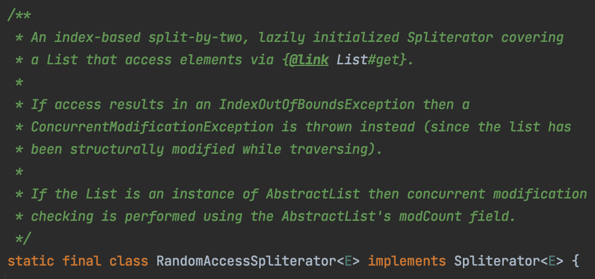

== Fork in the road

* When you see an interesting opportunity, pursue it
* link:https://donraab.medium.com/traveling-the-road-from-idea-all-the-way-to-openjdk-fc7ae04371a5?source=friends_link&sk=dee025810df6a898e0796dd2586287d7[Traveling the road from Idea all the way to OpenJDK]
** See something -- London, May 2013
** link:https://mail.openjdk.org/pipermail/lambda-libs-spec-experts/2013-May/001763.html[Say something] -- lambda-lib-spec-experts, May 2013
** Prove something -- JMH benchmark, July 2015
** link:https://mail.openjdk.org/pipermail/core-libs-dev/2016-May/041007.html[Do something] -- core-libs-dev (link:https://twitter.com/itohiro73[Hiroshi Ito], link:https://twitter.com/PaulSandoz[Paul Sandoz]), May 2016
* ```RandomAccessSpliterator``` - contained in ```AbstractList``` in Java 9, September 2017

* It's possible to get an idea into the OpenJDK if you have passion, patience and persistence

---

link:./00_toc.adoc[TOC] /
link:10_let_it_go.adoc[Let it go] /
link:./A0_appendix.adoc[Appendix]

===== link:https://twitter.com/hashtag/IntelliJIDEAConf[#IntelliJIDEAConf] link:https://twitter.com/TheDonRaab[@TheDonRaab]
