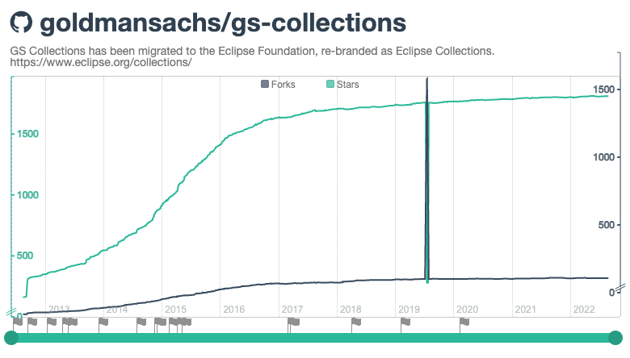

== An OSS story - Decade One

* 2004 -- Created Caramel in Goldman Sachs (GS)
* 2011 -- Joined JSR 335 Expert Group (libraries)
* 2012 -- link:https://twitter.com/motlin[Craig Motlin] Project Lead for GS Collections (GSC)
* 2012 -- Open Sourced GS Collections on Goldman Sachs GitHub account
* 2012 -- link:http://wiki.jvmlangsummit.com/images/c/c2/Raab_Collections_Design.pdf[Presented on Java collection framework design] at JVM Language Summit
* 2013 -- link:11_look_for_forks.adoc[**Fork in the road**] -- Performance of default spliterators in OpenJDK
* 2014 -- Java 8 Released w/ Lambdas and Streams
* 2014 -- JavaOne -- Participated in Strategy Keynote & first JavaOne presentation on GSC w/ Craig Motlin
* 2014 -- InfoQ articles: GS Collections by Example - link:https://www.infoq.com/articles/GS-Collections-by-Example-1/[Part 1] / link:https://www.infoq.com/articles/GS-Collections-by-Example-2/[Part 2]

---

link:./00_toc.adoc[⬆️ TOC] /
link:A0_appendix.adoc[⬅️ Appendix] /
link:./A2_oss_story_decadetwo.adoc[➡️ An OSS Story - Decade two]
