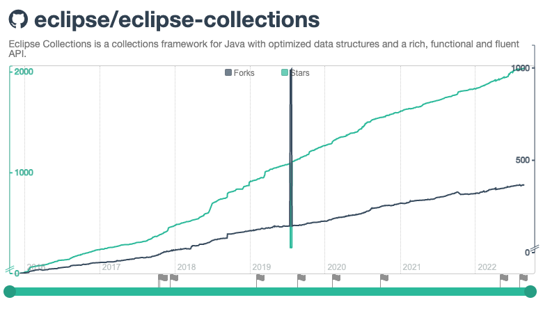

== My OSS story - Decade Two

* 2015 -- GS Collections (GSC) passes 1,000 stars on GitHub
* 2015 -- link:https://twitter.com/itohiro73[Hiroshi Ito] becomes Project Lead for Eclipse Collections (EC)
* 2015 -- link:https://www.infoq.com/news/2016/01/GS-Collections-Eclipse-Foundn/[GS Collections 7.0 -> Eclipse Collections 7.0] at Eclipse Foundation
* 2016 -- link:https://github.com/eclipse/eclipse-collections/releases/tag/8.0.0[Eclipse Collections 8.0 released]
* 2017 -- link:https://twitter.com/NikhilNanivade[Nikhil Nanivadekar] link:https://projects.eclipse.org/projects/technology.collections/elections/election-nikhil-nanivadekar-project-lead-eclipse-collections[elected Project Lead] for EC
* 2017 -- link:https://donraab.medium.com/nine-features-in-eclipse-collections-9-0-a2ca97dfdf74?source=friends_link&sk=1728577e9ef0b3c03f58791b5bade2be[Eclipse Collections 9.0 released]
* 2017 -- Started blogging on Medium - One Blog per Month commitment
* 2018 -- Donald Raab, Nikhil Nanivadekar link:https://blogs.oracle.com/java/post/30-new-java-champions-confirmed-in-2018[selected as Java Champions]
* 2019 -- link:https://medium.com/oracledevs/eclipse-collections-10-0-released-49bae6a4b4c6?source=friends_link&sk=a94837d5317ce2863be2c259fee8db41[Eclipse Collections 10.0 released]
* 2020 -- EC included in link:https://blogs.oracle.com/javamagazine/post/the-top-25-greatest-java-apps-ever-written[The 25 greated Java apps ever written] article
* 2020 -- link:https://twitter.com/sirishapratha[Sirisha Pratha] link:https://projects.eclipse.org/projects/technology.collections/elections/election-sirisha-pratha-committer-eclipse-collections[elected Committer] for EC
* 2021 -- link:https://donraab.medium.com/eclipse-collections-11-0-released-d14df63f5d1d?source=friends_link&sk=74bad1fcf0f384fba241041c8383502b[Eclipse Collections 11.0 released]
* 2022 -- link:https://medium.com/javarevisited/eclipse-collections-11-1-released-acca6905585a?source=friends_link&sk=901bc67401466f1d06bb9376f4b1dba2[Eclipse Collections 11.1 released]

link:./00_toc.adoc[TOC] /
link:A1_mystory_decadeone.adoc[My OSS Story - Decade one] /
link:./A3_planning_success.adoc[Planning for success]
